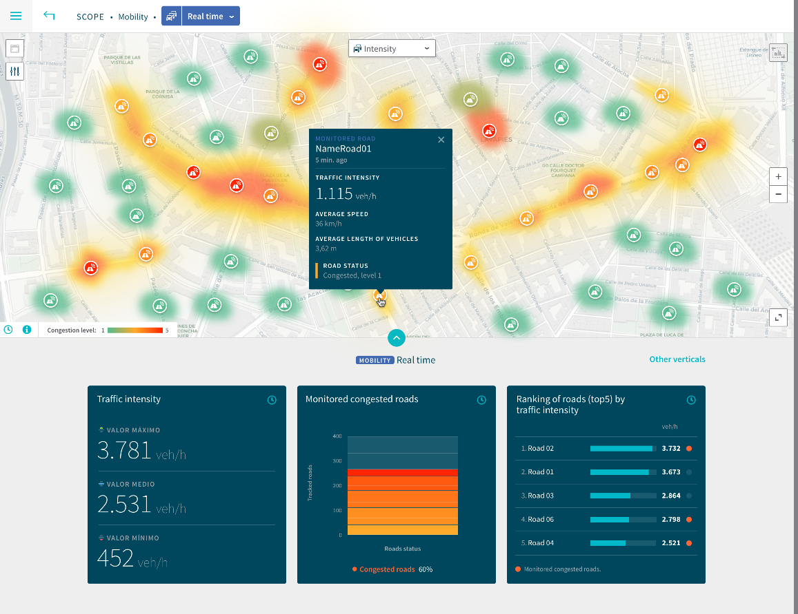

# Real time



## Traffic intensity


```bash
$ curl '/api/madrid/variables/traffic.trafficflowobserved.intensity/now'  \
    -H 'X-Access-Token: ***'  \
    -X POST \
    --data '{"agg": ["MAX", "MIN", "AVG"]}' \
    -vv -H 'Content-Type: application/json'
```
```json
{
  "value": {
    "MAX": 9000,
    "MIN": 65,
    "AVG": 1991.4138026607538
  }
}
```

## Monitored congested roads


Sensor count:

```bash
$ curl '/api/madrid/variables/traffic.trafficflowobserved.intensity/now' \
    -H 'X-Access-Token: ***' \
    -X POST \
    --data '{"agg": ["COUNT"]}' \
    -vv -H 'Content-Type: application/json'
```

```json
{
  "value": {
    "COUNT": 3608
  }
}
```

Congested count:

```bash
$ curl '/api/madrid/variables/traffic.trafficflowobserved.intensity/now'  \
    -H 'X-Access-Token: ***' \
    -X POST \
    --data '{
        "agg": ["COUNT"],
        "filters":{
            "condition":{
                "AND": {"congested__eq": true}
            }
        }
    }' \
    -vv -H 'Content-Type: application/json'
```

```json
{
  "value": {
    "COUNT": 2500
  }
}
```

From those two values the widget can be built.

## Ranking of roads 


```bash
$ curl '/api/madrid/variables/ranking/now' \
    -H 'X-Access-Token: ***'  \
    -X POST \
    -vv \
    -H 'Content-Type: application/json' \
    --data '{
        "vars": [
            "traffic.trafficflowobserved.congested", 
            "traffic.trafficflowobserved.description", 
            "traffic.trafficflowobserved.intensity"
        ], 
        "var_order": "traffic.trafficflowobserved.intensity", 
        "limit": 5
    }' 

```

```json
[
  {
    "congested": false,
    "description": "20010-Cea Bermudez - Blasco Garay-Galileo",
    "intensity_sat": 9000
  },
  {
    "congested": false,
    "description": "26020-AV.ANDALUCIA S-N AV.ROSALES-AV.POBLADOS ",
    "intensity_sat": 7200
  },
  {
    "congested": false,
    "description": "26001-AV. ANDALUCIA S-N  TERTULIA-UNANIMIDAD ",
    "intensity_sat": 7200
  },
  {
    "congested": false,
    "description": "26013-AV. ANDALUCIA S-N UNANIMIDAD-M40 ",
    "intensity_sat": 7200
  },
  {
    "congested": false,
    "description": "26016-AV. ANDALUCIA S-N CONIFERAS-AV.ROSALES ",
    "intensity_sat": 7200
  }
]
```